<div align="center">

# Sawt · صوت

**Bilingual (Arabic / English) multi-speaker conversation analysis with audio language models**

[](https://github.com/Mox301/sawt/actions/workflows/ci.yml)


</div>

Sawt ("voice" in Arabic) takes a recorded conversation and returns a structured
analysis:

- who spoke when, and for how long;
- what the conversation was about, and how its sentiment developed;
- how each speaker sounded: pitch, energy, rate and voice quality;
- how they interacted: turn-taking, interruptions, rapport and dominance.

It combines an **audio-language model** that listens to the recording directly with
**speaker diarization** and **signal-processing measurements**. It can return every
result in English and Arabic.

## Why this design

Most speech-analytics pipelines transcribe first (ASR) and then analyse the text.
That works poorly for Arabic conversations:

- dialectal speech raises ASR error rates;
- a transcript discards the paralinguistic cues (tone, emphasis, hesitation) that
  carry much of the sentiment.

Sawt instead lets **Voxtral-Mini-3B** reason over the audio itself. Two measured
components constrain it:

| Component | Model / method | Role |
|---|---|---|
| Audio understanding | [Voxtral-Mini-3B-2507](https://huggingface.co/mistralai/Voxtral-Mini-3B-2507) | Conversation, speaker, prosody and interaction analysis as JSON |
| Speaker diarization | [pyannote community-1](https://huggingface.co/pyannote/speaker-diarization-community-1) | Who spoke when; given to the audio model as context |
| Acoustic measurement | librosa | Pitch, RMS energy, spectral shape, onset rate, pauses |
| Turn-taking | Computed from diarization | Gaps, overlaps, interruptions, switch rate |
| Arabic output | Fixed glossary + [Qwen3-4B-Instruct-2507](https://huggingface.co/Qwen/Qwen3-4B-Instruct-2507) | Consistent Arabic labels, natural Arabic free text |

The audio model writes its analysis in English; the Arabic version comes from the
translation step. Speaking rate is measured as onset density (syllable-like events per
second).

The language model describes; the measurements anchor it:

- measured categories fill in values the model could not judge;
- exact numbers are reported next to its descriptions;
- measured turn-taking replaces the model's guesses.

See [docs/architecture.md](docs/architecture.md) for the full pipeline.

<p align="center">
  <picture>
    <source media="(prefers-color-scheme: dark)" srcset="docs/images/overview-dark.svg">
    
  </picture>
</p>

## Quick start

All three setups serve the UI at <http://localhost:8501> and the API at
<http://localhost:8000> (OpenAPI docs at `/docs`).

The diarization model is gated. Before downloading models:

1. Accept its terms at <https://huggingface.co/pyannote/speaker-diarization-community-1>.
2. Give the downloader a Hugging Face token: either put `HF_TOKEN=…` in `.env` (copy it
   from `.env.example`), or run `uv run --project backend hf auth login` after
   `make setup`.

### NVIDIA GPU (Docker)

Requires Linux with [nvidia-container-toolkit](https://docs.nvidia.com/datacenter/cloud-native/container-toolkit/).

```bash
make up    # downloads the models into a Docker volume, then starts api + ui
```

### Apple Silicon (native, GPU via MPS)

Docker on macOS cannot use the Apple GPU, so on a Mac the API runs natively. Voxtral and
pyannote run on the GPU through PyTorch MPS. Translation runs on
[Ollama](https://ollama.com), using a 4-bit Qwen3-4B so the models fit in unified memory.
Ollama serves only the translation model.

```bash
make setup                                   # uv environments for backend and frontend
uv run --project backend hf auth login       # once, unless HF_TOKEN is in .env
SAWT_TRANSLATION_BACKEND=off make models     # Voxtral + pyannote weights (translation runs on Ollama)
make dev-mac                                 # pulls the Ollama model if needed, starts API + UI
```

### CPU only (Docker, any machine)

```bash
make up-cpu    # translation via Ollama on the host; give Docker Desktop ≥ 14 GB of memory
```

## API

| Endpoint | Purpose |
|---|---|
| `GET /api/v1/health` | Readiness and per-model status |
| `POST /api/v1/conversations/analyze` | Analyse an uploaded recording (`audio` file, optional `translate=true`) |
| `WS /api/v1/conversations/stream` | Stream a recording in chunks, get the analysis at the end |

```bash
curl -F audio=@call.wav -F translate=true http://localhost:8000/api/v1/conversations/analyze
uv run --project backend python examples/stream_client.py call.wav --translate
```

Request and response formats are in [docs/api.md](docs/api.md).

## Configuration

Everything is set through environment variables or `.env`; see [.env.example](.env.example).

| Variable | Default | |
|---|---|---|
| `SAWT_DEVICE` | `auto` | `cuda`, `mps` or `cpu` (auto picks in that order) |
| `SAWT_TRANSLATION_BACKEND` | `transformers` | `transformers` (Qwen3-4B on the same device), `ollama`, or `off` |
| `SAWT_ENABLE_DIARIZATION` | `true` | Turn off to skip pyannote |
| `SAWT_MAX_UPLOAD_MB` | `100` | Upload and stream size limit |

## Project layout

```
backend/            FastAPI service, layered:
  api/              routes, schemas, error mapping            (HTTP / WebSocket only)
  services/         use cases: conversation analysis, translation, streaming sessions
  domain/           pure logic: acoustics, diarization stats, turn-taking, parsing, Arabic rules
  infrastructure/   adapters: audio decoding, Voxtral, pyannote, Qwen (transformers / Ollama)
  prompts/          model prompts
  tests/            unit + API tests with in-memory model fakes
frontend/           Streamlit UI (English / Arabic, RTL)
examples/           WebSocket streaming client
docs/               architecture and API reference
```

## Development

```bash
make test     # backend + frontend tests; no model weights needed
make lint     # ruff
```

The services depend on small model interfaces (`AudioLLM`, `TextLLM`, `Diarizer`), so
the whole pipeline is tested on any laptop and in CI with fake models.

## Citation

```bibtex
@software{moustafa2026sawt,
  author  = {Moustafa, Moamen},
  title   = {Sawt: Bilingual Arabic/English Conversation Analysis with Audio Language Models},
  year    = {2026},
  version = {1.0.0},
  url     = {https://github.com/Mox301/sawt}
}
```

## License

Code: [MIT](LICENSE). The models are downloaded separately under their own licences:

- Voxtral-Mini-3B-2507: Apache-2.0
- Qwen3-4B-Instruct-2507: Apache-2.0
- pyannote speaker-diarization-community-1: CC-BY-4.0
