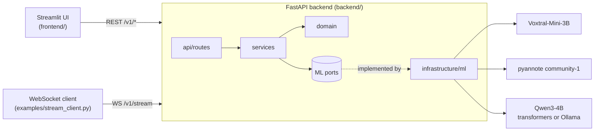
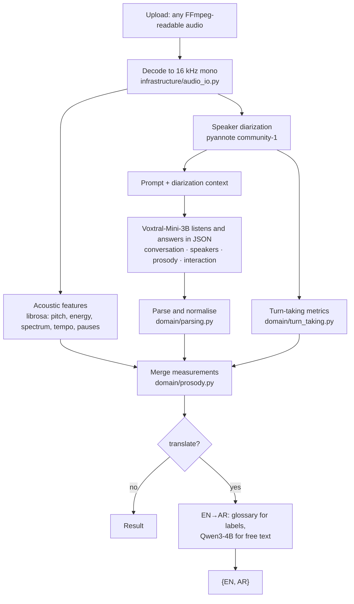

# Architecture

Sawt is two services: a FastAPI backend that runs the models, and a Streamlit
frontend that calls it over HTTP.

## Analysis pipeline

1. **Decode.** Any format FFmpeg reads is converted to 16 kHz mono. One temporary
   WAV is written for the audio LLM, which reads from a path. The same samples are kept
   in memory for diarization and feature extraction. The file is deleted when the
   request ends.
2. **Diarize.** pyannote finds who spoke when (1–10 speakers). Turns become per-speaker
   statistics and a timeline that flags quick responses and overlaps
   (`domain/diarization.py`).
3. **Measure.** librosa computes pitch, RMS energy, spectral shape, onset rate,
   pauses and voice-quality features (`domain/acoustic.py`). All thresholds are named
   constants.
4. **Listen and analyse.** Voxtral-Mini-3B receives the audio and a prompt. When
   diarization succeeded, the prompt also gets the detected speaker count and
   speaking-time split. There is no separate speech-recognition step: the
   audio-language model reasons over the audio directly and returns JSON.
5. **Normalise.** The JSON is extracted and every field is coerced to its expected
   type and allowed values. Malformed output falls back to a well-formed placeholder
   result, so clients always get the same shape.
6. **Merge.** The LLM describes; the signal processing measures:
   - Measured categories fill in prosody fields the model left as "Unknown".
   - Exact numbers are attached as `quantitative_metrics`.
   - The model's duration guess is replaced by the real duration.
   - Measured turn-taking replaces its turn-taking guesses.
7. **Translate (optional).** Categorical values ("Positive", "Interviewer", "High")
   map through a fixed glossary, so labels stay consistent. Free-text fields go to
   Qwen3-4B in batches. Speaker references are masked as `__SPK_n__` and restored as
   Arabic labels (`متحدث ١`), so names never drift between fields.

## Code layout and dependency rule

| Layer | Folder | Responsibility | May import |
|---|---|---|---|
| Presentation | `backend/api/` | HTTP/WebSocket, request validation, error → status mapping | services, core |
| Application | `backend/services/` | Use cases: conversation, sentiment, translation, streaming sessions, inference gate | domain, prompts, infrastructure (ML only via `interfaces.py`) |
| Domain | `backend/domain/` | Pure logic on arrays and dicts: features, diarization stats, turn-taking, parsing, Arabic text rules | nothing outside `domain/` |
| Infrastructure | `backend/infrastructure/` | Adapters: audio decoding, model loading, Voxtral, pyannote, Qwen (transformers or Ollama) | core, domain entities |
| Cross-cutting | `backend/core/` | Settings, logging, exceptions | — |

- `backend/container.py` is the composition root: it takes the loaded adapters and
  builds the services.
- Services depend on the `AudioLLM`, `TextLLM` and `Diarizer` protocols, not on torch.
  That is why the whole test suite runs on a laptop or in CI without downloading a
  model.
- Results stay plain JSON-compatible dicts. Their keys are documented as `TypedDict`s
  in `domain/entities.py`.

## Runtime behaviour

- **Startup.** The server starts immediately and loads models in a background thread.
  `GET /health` reports `loading`, then `ready`. It reports `degraded` when an
  optional model (diarization or translation) failed, and `unavailable` when the audio
  model failed. Each model loads independently: a missing translation model only
  disables translation.
- **Concurrency.** Inference runs in a worker thread behind a single lock
  (`services/inference_gate.py`). One accelerator handles one analysis at a time, while
  the event loop keeps serving health checks and WebSocket traffic.
- **Devices.** `SAWT_DEVICE=auto` picks CUDA, then Apple MPS, then CPU. The dtype is
  bf16 on CUDA and CPU, and fp16 with eager attention on MPS.
- **Decoding.** Greedy: the model's generation config does not enable sampling, so the
  same audio gives the same analysis on the same hardware.
- **Limits.**
  - Uploads and streams are capped by `SAWT_MAX_UPLOAD_MB` (413 when exceeded).
  - Concurrent streams are capped by `SAWT_STREAM_MAX_SESSIONS` (429).
  - Idle streams close after `SAWT_STREAM_IDLE_TIMEOUT_S`.

## Errors

| Exception (`core/exceptions.py`) | HTTP | When |
|---|---|---|
| `ModelNotReadyError` | 503 | Models are still loading or the audio model failed |
| `AudioDecodeError` | 422 | The upload is not decodable audio, or is empty |
| `PayloadTooLargeError` | 413 | Upload or stream exceeds the size limit |
| `TooManySessionsError` | 429 | All streaming slots are in use |
| `StreamProtocolError` | 400 | Unexpected WebSocket message or idle timeout |

On the WebSocket, the same errors are sent as `{"type": "error", "status": <code>, "detail": ...}`
and then the socket is closed.
